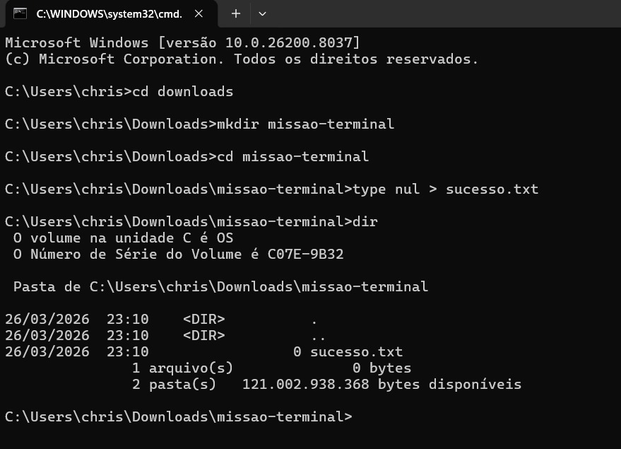

# ⚡ Meus Comandos Favoritos
Aqui estão os comandos que mais utilizei na aula de Terminal:

- `cd`: Para navegar entre pastas.
- `dir`: Para listar arquivos.
- `mkdir`: Para criar pastas.
- `echo`: Para criar arquivos ou escrever texto.
- `type nul`: Para criar arquivos vazios.

## 📸 Evidência de Execução

